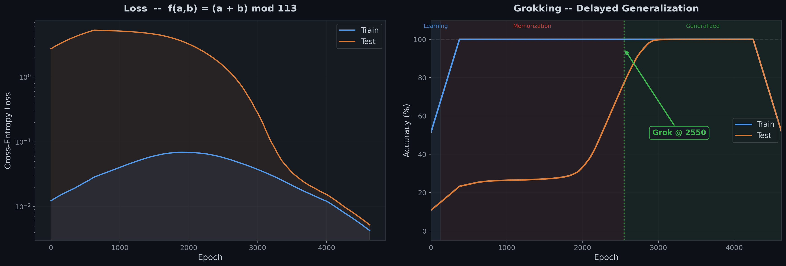
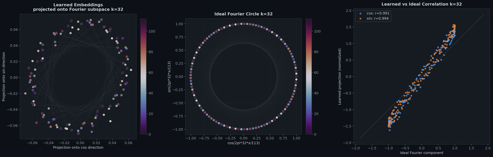

# Grokking & Fourier Features in Modular Addition

A small transformer trained on modular addition learns a **Discrete Fourier Transform** algorithm internally — something no human would guess from input-output behavior alone.

This project reproduces the key finding from [Nanda et al. (2023)](https://arxiv.org/abs/2301.05217): when a 1-layer transformer is trained on `(a + b) mod 113` with weight decay, it first memorizes the training data, then suddenly *generalizes* — a phenomenon called **grokking**. Mechanistic analysis reveals the network discovered Fourier analysis on the cyclic group Z/113Z.



## The Key Finding

The network doesn't learn a lookup table. It learns an algorithm:

1. **Embed** each number `x` as Fourier components `[cos(2πkx/p), sin(2πkx/p)]` for a sparse set of frequencies `k`
2. **Attention** combines them via the trigonometric identity:
   ```
   cos(2πk(a+b)/p) = cos(2πka/p)·cos(2πkb/p) − sin(2πka/p)·sin(2πkb/p)
   ```
3. **MLP** neurons become tuned to specific frequencies, processing the combined Fourier representation
4. **Unembed** reads off the answer from the Fourier components

The network independently discovered harmonic analysis on finite groups — a deep result from abstract algebra — just from seeing examples of addition.



## Quick Start (Local)

```bash
pip install torch numpy matplotlib
python run.py
```

All outputs (model, metrics, 7 figures) are saved to `outputs/`.

## Running on Northeastern's Explorer Cluster

This was trained on Northeastern University's [Explorer HPC cluster](https://rc.northeastern.edu/) using SLURM. Here's what it took to get it running — including the gotchas.

### Cluster Setup

```bash
# SSH into the cluster
ssh your_username@login.discovery.neu.edu

# Upload project files
scp run.py submit.sh requirements.txt your_username@login.discovery.neu.edu:~/grokking/
```

### Finding Available GPUs

The Explorer cluster has a GPU monitor page, but from the terminal:

```bash
sinfo -p gpu --format="%N %G %f" | head -20
```

At the time of running, the cluster had V100s, A100-80GBs, H200s, T4s, and others available. The A100 nodes (`d1028-1029`) were idle and offered the best balance of availability and speed.

### SLURM Submission

The `submit.sh` script:

```bash
#!/bin/bash
#SBATCH --job-name=grokking
#SBATCH --output=grokking_%j.out
#SBATCH --error=grokking_%j.err
#SBATCH --partition=gpu
#SBATCH --nodes=1
#SBATCH --ntasks=1
#SBATCH --gres=gpu:a100:1
#SBATCH --cpus-per-task=4
#SBATCH --mem=16GB
#SBATCH --time=02:00:00

module unload cuda 2>/dev/null
module load anaconda3/2024.06
module load cuda/12.8.0

source activate llms

python run.py
```

Submit and monitor:

```bash
cd ~/grokking
sbatch submit.sh
squeue -u $USER                         # check job status
tail -f grokking_$(squeue -u $USER -h -o %i).out   # live output
```

### Lessons Learned on the Cluster

**Module conflicts:** The default environment already had a CUDA version loaded. Running `module load cuda/12.8.0` directly failed with a conflict error. Fix: `module unload cuda` before loading.

**CUDA version discovery:** `module spider cuda` didn't work on Explorer (different module system). Had to use `module load cuda` to find that `cuda/12.8.0` was available.

**GPU partition rules:** On the `gpu` partition, you can only request 1 GPU per job (`--gres=gpu:1`). Requesting more causes the job to fail silently. For the A100-80GB nodes specifically, use `--gres=gpu:a100:1`.

**Checking GPU availability:** The cluster GPU monitor shows real-time node status. At submission time, both A100-80GB nodes (`d1028-1029`) were idle, so the job started instantly.

**Download results:**
```bash
scp -r your_username@login.discovery.neu.edu:~/grokking/outputs/ D:\github\grokking\outputs\
```

Training completed in ~33 seconds on the A100 — 25,000 epochs of a 227K parameter model. The 7 analysis figures were generated immediately after.

## Lessons Learned: What Makes Grokking Work (and Fail)

Getting grokking to work reliably took several failed attempts. Here's what we learned:

### Failed Attempt 1: Complex Polynomial with Cosine LR
- **Equation:** `(a³ + a²b + ab² + b³) mod 97`
- **Problem:** Cosine LR schedule decayed the learning rate from 1e-3 to 1e-4 during training. Test accuracy plateaued at exactly 30% for 50,000 epochs.
- **Root cause:** Grokking requires sustained optimization pressure. Once LR decays, the model locks into its memorized solution.

### Failed Attempt 2: Degree-5 Polynomial with Multiplicative Terms
- **Equation:** `(a⁵b + ab⁵ + a³b³ + a²b + ab²) mod 127`
- **Problem:** Train accuracy reached 100%, test accuracy stuck at ~40%. Ran for 80,000 epochs.
- **Root cause:** The multiplicative `ab` factor requires ALL Fourier frequencies simultaneously. There's no sparse Fourier circuit to discover — the equation is fundamentally not Fourier-decomposable in a sparse way.

### What Actually Works
- **Constant learning rate** — no schedule, no decay. This is what Nanda et al. used.
- **Strong weight decay (WD=1.0)** — the engine that compresses memorized weights into Fourier circuits.
- **Fourier-decomposable equations** — `(a+b) mod p` is the canonical example. The sum has a clean trig identity.
- **Prime modulus** — ensures no subgroup shortcuts in Z/pZ.

## Project Structure

```
grokking/
├── run.py              # Complete pipeline: training + Fourier analysis + 7 figures
├── submit.sh           # SLURM batch script for Northeastern Explorer cluster
├── requirements.txt    # torch, numpy, matplotlib
├── README.md
└── outputs/
    ├── model.pt                          # Trained weights
    ├── config.json                       # Hyperparameters
    ├── history.json                      # Training metrics (every 25 epochs)
    ├── 01_grokking_curve.png             # Train/test loss and accuracy
    ├── 02_fourier_spectrum.png           # Power spectrum of embedding & unembedding
    ├── 03_embedding_fourier_heatmap.png  # Fourier coefficient matrix
    ├── 04_mlp_neuron_fourier.png         # Per-neuron frequency selectivity
    ├── 05_fourier_circles.png            # Learned vs ideal Fourier circles + correlation
    ├── 06_algorithm_summary.png          # Full algorithm diagram with statistics
    └── 07_logit_fourier_analysis.png     # Logit decomposition into Fourier modes
```

## Output Figures

| # | Figure | What it shows |
|---|--------|---------------|
| 1 | **Grokking Curve** | Train accuracy hits 100% early; test accuracy stays low for thousands of epochs, then suddenly jumps |
| 2 | **Fourier Spectrum** | Embedding and unembedding matrices concentrate power in a sparse set of Fourier frequencies |
| 3 | **Embedding Heatmap** | Full matrix of Fourier coefficients showing which model dimensions encode which frequencies |
| 4 | **MLP Neurons** | Individual neurons become tuned to specific Fourier frequencies, like auditory cortex neurons tuned to pitch |
| 5 | **Fourier Circles** | Learned embeddings projected onto Fourier directions form circles matching the theoretical prediction |
| 6 | **Algorithm Summary** | Combined diagram showing spectra, algorithm flow, grokking curve, and model statistics |
| 7 | **Logit Fourier** | Output logits can be reconstructed from just a few Fourier modes |

## Model Details

| Parameter | Value | Why |
|-----------|-------|-----|
| Equation | `(a + b) mod 113` | Prime p, clean Fourier structure |
| Architecture | 1-layer transformer | Cleanest Fourier features |
| d_model | 128 | Sparse Fourier representation |
| Heads | 4 | Frequency group specialization |
| MLP width | 512 | Enough for frequency selectivity |
| Training data | 30% of all pairs | Forces generalization |
| Weight decay | 1.0 | Drives grokking |
| Learning rate | 1e-3 (constant) | No schedule — critical |
| Parameters | 227,328 | Tiny model |
| Training time | ~33s on A100 | Fast |

## References

- **Nanda, N., Chan, L., Lieberum, T., Smith, J., & Steinhardt, J.** (2023). "Progress measures for grokking via mechanistic interpretability." *ICLR 2023*. [arXiv:2301.05217](https://arxiv.org/abs/2301.05217)
- **Power, A., Burda, Y., Edwards, H., Babuschkin, I., & Misra, V.** (2022). "Grokking: Generalization beyond overfitting on small algorithmic datasets." *ICLR 2022 MATH-AI Workshop*.
- **Zhong, Z., Liu, Z., Tegmark, M., & Andreas, J.** (2023). "The Clock and the Pizza: Two Stories in Mechanistic Explanation of Neural Networks." *NeurIPS 2023*.

## License

MIT
